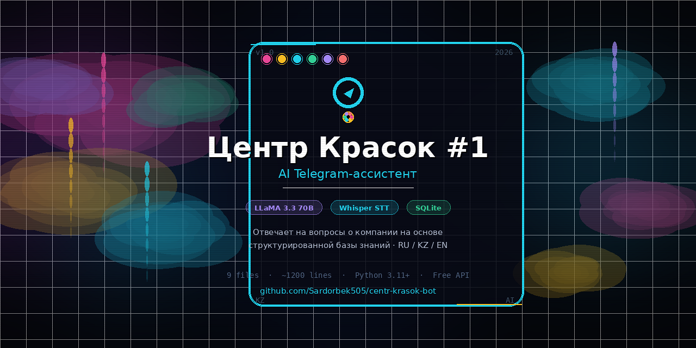

<div align="center">

# 🎨 Центр Красок #1 — AI Telegram Bot

**Умный ассистент для интернет-магазина лакокрасочных материалов**

[](https://python.org)
[](https://core.telegram.org/bots)
[](https://groq.com)
[](https://groq.com)
[](https://sqlite.org)
[](LICENSE)



> Тестовое задание: разработка AI Telegram-ассистента на основе реальных данных компании [centr-krasok.kz](https://centr-krasok.kz)

</div>

---

## 📌 О проекте

Бот работает как полноценный AI-ассистент магазина «Центр Красок #1» — отвечает на вопросы о компании в формате живого чата, без команд и меню. Пользователь пишет или **говорит** вопрос — бот отвечает на основе структурированной базы знаний о компании.

### Что было сделано:

- **Сбор данных** — спарсен официальный сайт centr-krasok.kz, извлечено и структурировано 6000+ символов актуальной информации: контакты, адреса, 20+ категорий товаров, 40+ брендов, партнёры, условия доставки, цены
- **AI-интеграция** — подключён Groq API (LLaMA 3.3 70B) со строгим system prompt, ограничивающим галлюцинации
- **Голосовой ввод** — Groq Whisper large-v3-turbo распознаёт русскую речь прямо в боте
- **UX** — inline-кнопки быстрых вопросов, оценка ответов 👍👎, индикатор набора
- **Аналитика** — SQLite БД логирует пользователей, сообщения и оценки; `/stats` для администратора

---

## 🚀 Возможности

| Функция | Описание |
|---------|----------|
| 💬 **Чат без команд** | Пользователь пишет обычные вопросы — никакого меню |
| 🎙️ **Голосовые сообщения** | Whisper распознаёт речь → передаёт в AI |
| 🧠 **Контекст диалога** | Бот помнит последние 10 сообщений разговора |
| 🛡️ **Защита от галлюцинаций** | Строгий system prompt + температура 0.4 |
| 👍👎 **Оценка ответов** | Inline-кнопки после каждого ответа, фидбек в БД |
| 🎯 **Быстрые вопросы** | 6 кнопок с популярными темами на `/start` |
| 📊 **Аналитика** | `/stats` — пользователи, сообщения, удовлетворённость |
| ⏱️ **Rate limiting** | Защита от спама: 15 запросов/мин на пользователя |
| 🌐 **Мультиязычность** | Отвечает на языке пользователя (RU / KZ / EN) |
| 🗄️ **SQLite** | Автоматическое логирование всех пользователей и оценок |

---

## 🏗️ Архитектура

```
centr_krasok_bot/
├── bot.py              # Точка входа: все хэндлеры, UX, callback-кнопки
├── ai_handler.py       # Groq LLaMA API + управление историей диалога
├── knowledge_base.py   # База знаний о компании (структурированные данные)
├── database.py         # SQLite: пользователи, оценки, статистика
├── config.py           # Конфигурация через .env
├── requirements.txt    # Зависимости
├── .env.example        # Шаблон переменных окружения
└── README.md
```

### Схема работы

```
Пользователь
    │
    ├─── Текст ──────────────────────────────────────────────┐
    │                                                        │
    └─── Голосовое → Groq Whisper STT → Текст ──────────────┤
                                                             │
                                                    ai_handler.py
                                                             │
                                              System Prompt + Knowledge Base
                                                             │
                                               Groq LLaMA 3.3 70B
                                                             │
                                                    Ответ + 👍👎 кнопки
                                                             │
                                                    database.py (лог)
```

---

## ⚡ Быстрый старт

### Требования
- Python 3.11+
- Telegram Bot Token ([@BotFather](https://t.me/BotFather))
- Groq API Key (бесплатно на [console.groq.com](https://console.groq.com))

### Установка

```bash
# 1. Клонировать репозиторий
git clone https://github.com/Sardorbek505/centr-krasok-bot.git
cd centr-krasok-bot

# 2. Создать виртуальное окружение
python -m venv venv
source venv/bin/activate      # Linux/macOS
venv\Scripts\activate         # Windows

# 3. Установить зависимости
pip install -r requirements.txt

# 4. Настроить переменные окружения
cp .env.example .env          # Linux/macOS
copy .env.example .env        # Windows
# Открыть .env и заполнить токены

# 5. Запустить
python bot.py
```

### Переменные окружения (`.env`)

```env
TELEGRAM_BOT_TOKEN=ваш_токен_от_BotFather
GROQ_API_KEY=ваш_ключ_от_Groq
GROQ_MODEL=llama-3.3-70b-versatile
ADMIN_TELEGRAM_ID=ваш_telegram_id   # узнать у @userinfobot
```

---

## 💬 Примеры диалога

```
👤 Чем занимается компания?
🤖 «Центр Красок #1» — интернет-магазин строительных красок, лаков и малярных 
   инструментов. Компания является официальным дистрибьютором европейских 
   брендов (Dulux, Hammerite, Pinotex и др.) и доставляет по всему Казахстану.

👤 Есть ли краски для детской комнаты?
🤖 Да! У нас есть специальные краски для детских комнат — экологически чистые,
   сертифицированные европейскими лабораториями. Они безопасны даже для 
   использования в школах и детских садах. Рекомендую обратить внимание на 
   линейку Dulux. Подробнее на centr-krasok.kz 🎨

👤 [голосовое сообщение: "где находится магазин?"]
🤖 🗣️ Вы сказали: где находится магазин?
   У нас два магазина в Алматы и один в Астане:
   📍 Алматы: ул. Кабдолова 1/8, бутики 14 и 21
   📍 Астана: ул. Мангилик Ел, 29/2
   Работаем ежедневно с 10:00 до 20:00 🕙
```

---

## 📊 Аналитика (`/stats`)

Доступна только администратору. Показывает:

```
📊 Статистика бота

👥 Всего пользователей: 47
🟢 Активны сегодня: 12
💬 Всего сообщений: 384
🎙️ Голосовых: 67

Оценки ответов:
👍 Полезно: 89
👎 Не полезно: 8
✅ Удовлетворённость: 92% (из 97 оценок)
```

---

## 🛡️ Защита от галлюцинаций

Реализована на нескольких уровнях:

1. **System prompt** — AI явно запрещено отвечать на вопросы вне базы знаний
2. **Температура 0.4** — низкая креативность = высокая точность
3. **Перенаправление** — при отсутствии данных бот отправляет на сайт или в контакты
4. **Ограничение тем** — вопросы не о компании вежливо отклоняются

---

## 🚀 Деплой на сервер (Ubuntu)

```bash
# Создать systemd сервис
sudo nano /etc/systemd/system/centr-krasok-bot.service
```

```ini
[Unit]
Description=Centr Krasok AI Telegram Bot
After=network.target

[Service]
User=ubuntu
WorkingDirectory=/home/ubuntu/centr-krasok-bot
ExecStart=/home/ubuntu/centr-krasok-bot/venv/bin/python bot.py
Restart=always
RestartSec=10
EnvironmentFile=/home/ubuntu/centr-krasok-bot/.env

[Install]
WantedBy=multi-user.target
```

```bash
sudo systemctl daemon-reload
sudo systemctl enable centr-krasok-bot
sudo systemctl start centr-krasok-bot
sudo systemctl status centr-krasok-bot   # ✅ active (running)
```

---

## 🔧 Стек технологий

| Технология | Версия | Назначение |
|-----------|--------|-----------|
| Python | 3.11+ | Основной язык |
| python-telegram-bot | 21.6 | Async Telegram API |
| Groq API (LLaMA 3.3 70B) | latest | AI ответы |
| Groq Whisper large-v3-turbo | latest | Speech-to-Text |
| SQLite | встроен | Аналитика и логирование |
| python-dotenv | 1.0.1 | Управление конфигурацией |

---

## 📁 Источники данных

Информация о компании собрана и структурирована вручную из открытых источников:
- 🌐 [centr-krasok.kz](https://centr-krasok.kz) — основной сайт
- 📱 [Instagram @centr_krasok](https://www.instagram.com/centr_krasok/)

---

## 👤 Автор

**Sardorbek Ermetov**  
Computer Science @ Satbayev University, Almaty  

[](https://github.com/Sardorbek505)
[](https://t.me/atabekovch)

---

<div align="center">
Made with ❤️ as a test assignment · 2026
</div>
